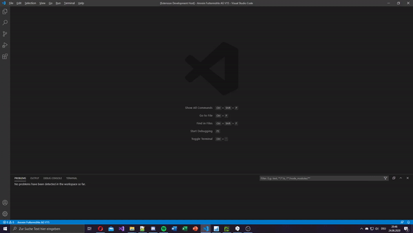
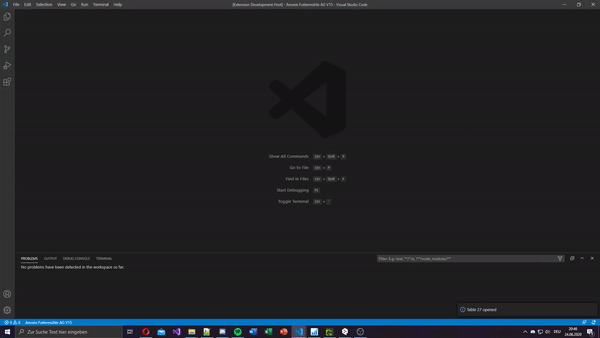
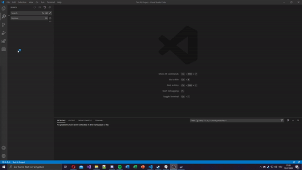

  

  <h3 align="center">AL Object Helper</h3>

  

    Quick and easy access to any al object in your project
     

    <a href="https://marketplace.visualstudio.com/items?itemName=DSaladin.al-object-helper">Download</a>
    ·
    <a href="https://github.com/DSaladinCH/al-object-helper/issues/new/choose">Report Bug / Request Feature</a>
  

# About this project
With this package you can quickly open all your local and app al files. Use shortcuts to open files even faster (for example `t18` to open the customer table or `p5050` to open the contact card).  
It supports a better event search than the integrated one and let you search for an event subscriber.

In a app al file, it is possible to view definitions and hover over them.  
This functionality may still contain errors. Possibly there are also definitions which have not yet been implemented. Please report those on the issue page.

# Features and Commands
## Open and search al objects
With the command **Open AL Object** (<kbd>Ctrl</kbd> + <kbd>Alt</kbd> + <kbd>O</kbd>) you can easly open any al object.
You can use shortcuts to quickly open a object (More about this in [Object Shortcuts](#object-shortcuts)).
It is also possible to search only in one specific app with the command **Open AL Object of App**.

## Local and app package al objects
Both local and app package files are supported. All app packages will be detected and read when opening the workspace and can be manually detected with the command **Reload Objects**.

## Copy events
The improved **Copy Event** command (<kbd>Shift</kbd> + <kbd>Alt</kbd> + <kbd>E</kbd>) uses a object grouped search and provides the events faster than the integrated one. Go to [Important Infos](#important-infos) to learn how to use the improved search.

## Local event subscribers
If you are searching for a event you already subscribed to, you can use the command **Jump to local Event Subscriber** to quickly search through all your local files and jump right to the subscriber.

## Object Extensions
If you are in a extension object (for example a table extension) you can navigate to the parent object by running the command **Open extended Object**. In, for example, a table you can view all objects which extended this table by running the command **Show Extensions**.

# Performance Modes
Specifies in which mode AL Object Helper should run. This mode is useful if the computer is not to powerful to load everything.

## Normal
Reads everything at startup and load everything needed when a command gets executed.

## Performance
Only reads necessary files on startup, but read additional informations on certain commands.

## Hyper Performance
Only reads necessary files on startup. This can not be overruled, except if a specific app get reloaded in mode "Full reload" (Command **Reread App**)

# Planned features
* Automatically research when changing branch
* AL Object List
* Read runtime apps

# Object Shortcuts
To quickly open any object you can use a object shortcut.  
Just run the command **Open AL Object** and use the type shortcut and the object id as follow:

| Shortcut | Description                                                    |
|----------|----------------------------------------------------------------|
| T        | Open a table                                                   |
| TE       | Open a table extension by the parent table id                  |
| TED      | Open a table extension                                         |
| P        | Open a page                                                    |
| PE       | Open a page extension by the parent page id                    |
| PED      | Open a page extension                                          |
| PC       | Open a page customization                                      |
| E        | Open a enum                                                    |
| EE       | Open a enum extension by the parent enum id                    |
| EED      | Open a enum extension                                          |
| R        | Open a report                                                  |
| RE       | Open a report extension by the parent report id                |
| RED      | Open a report extension                                        |
| C        | Open a codeunit                                                |
| X        | Open a xmlport                                                 |
| Q        | Open a query                                                   |
| PS       | Open a permission set                                          |
| PSE      | Open a permission set by the parent permission set id          |
| PSED     | Open a permission set extension                                |

# Examples
### Ex. T27 for Item Table

### Ex. P21 for Customer Page

# Important Infos
If you use the latest version of the AL Language Extension by Microsoft, you have to remove the "AL: Find Event" keybinding to use the integrated search.  

It is possible to jump to definition within an AL file.
This is a new feature and may still contain errors. Possibly there are also definitions which have not yet been implemented.
Please report these in the Git Repository.

# Requirements
<!-- prettier-ignore-start -->
<!-- markdownlint-disable -->
<table>
  <tr>
    <td align="center">
      <a href="https://marketplace.visualstudio.com/items?itemName=ms-dynamics-smb.al">
        
         
        <b>AL Language</b>
      </a>
    </td>
  </tr>
</table>
<!-- markdownlint-restore -->
<!-- prettier-ignore-end -->

# Commands
* **Open AL Object**: Search for any object (Shortcut: <kbd>Ctrl</kbd> + <kbd>Alt</kbd> + <kbd>O</kbd>)
* **Open AL Object of App**: Search for any object in a specific app
* **Copy Event**: Search and copy any event of a object (Shortcut: <kbd>Shift</kbd> + <kbd>Alt</kbd> + <kbd>E</kbd>)
* **Jump to local Event Subscriber**: Search for a local event subscriber and jump right to it
* **Open extended Object**: Open the extended object of the current object
* **Show Extensions**: Show all extensions for the current object
* **Reload**: Reload and reread all al objects according the user configurations
* **Reread App**: Rereads a certain app which options to fully read the app and ignore the user configurations

# Known Issues
- Reloading of objects causes perfomance issues
